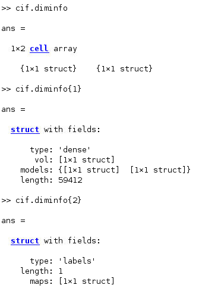
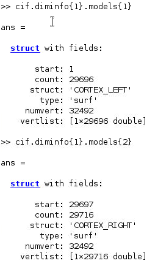
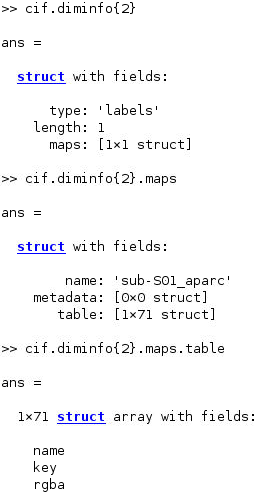

# Common Neuroimaging Data Structures in MATLAB

## Introduction

MATLAB is a common tool for neuroimaging analysis due to it performing matrix operations well by design and neuroimaging data naturally conforming to multi-dimensional matrix data structures. This guide aims to give you basic information on how to work with nifti, gifti, and cifti files in MATLAB.

Toolboxes mentioned here can be loaded by running the following command:

``` matlab
addpath(genpath('</path/to/toolbox>'))
```

## NIFTI

Reading in standard nifti files, such as those output from converting DICOMS to the BIDS format, can be read in using [FreeSurfer's](https://surfer.nmr.mgh.harvard.edu/) matlab toolbox. This toolbox comes standard with each FreeSurfer installation and can either be downloaded from their site or can be copied from one of Cheaha's FreeSurfer modules. The toolbox for FreeSurfer version 7.1.1 can be found at `/share/apps/rc/software/FreeSurfer/7.1.1-centos7_x86_64/matlab`. It's advised to make a copy of this toolbox in your personal space as opposed to adding the module to your path.

``` matlab
nif = load_nifti('<path>')
```

`nif` will be a struct where the `vol` field will contain either a 3D or 4D matrix, depending on if the data are cross-sectional or a time series. Each element within the matrix represents a voxel.

<!-- markdownlint-disable MD046 -->
!!! note

    This `matlab` folder also contains functions for reading and writing FreeSurfer's mgz, label, annot, etc. file formats into MATLAB as well. Look through the toolbox to see the options available to you for working with FreeSurfer in MATLAB
<!-- markdownlint-enable MD046 -->

## GIFTI

Reading GIFTI files into MATLAB can be done with the [gifti toolbox](https://github.com/gllmflndn/gifti). Either clone the repo into your space with `git clone` or download the repo using the green Code dropdown on the repo site.

<!-- markdownlint-disable MD046 -->
!!! note

    When adding the toolbox to your path, only use addpath() to the gifti directory, not addpath(genpath())
<!-- markdownlint-enable MD046 -->

After adding the toolbox to the path, you can read giftis with the `gifti` command.

``` matlab
gif = gifti('<path/to/gifti>')
```

Here, `gif` will be a struct with data field `cdata`. `cdata` will either be 1D or 2D and has a number of rows equal to the number of grayordinates on the surface the gifti describes whether valid data exists there or not. For instance, a left hemisphere cortical thickness gifti will have values for all left hemisphere vertices even though the vertices on the medial wall don't have any thickness.

If the gifti file is a label, it will also contain the `labels` struct. `labels` contains the key-value pairs for the label names. Each name corresponds to the key in order.

## CIFTI

Reading CIFTI files into MATLAB can be done with the [cifti toolbox](https://github.com/Washington-University/cifti-matlab). Either clone the repo into your space with `git clone` or download the repo using the green Code dropdown on the repo site.

This toolbox was written by the HCP team at Washington University and so has a number of tools in it for using CIFTI data in MATLAB. Please look through it to see what it has available for you.

To read ciftis, use the `cifti_read` command.

```matlab
cif = cifti_read('path/to/cifti')
```

Cifti outputs can be difficult to parse overall. The data of interest is in the `cdata` field with a number of rows equal to the number of brainordinates which have valid data. This means not all cortical and subcortical vertices are represented, unlike was the case with gifti. To tell which `cdata` rows correspond to which brainordinates, you will need to use the `diminfo` field.

For an example, let's take the `fsaverage_LR32k` representation of a participant's aparc cifti file, a standard cortical parcellation from FreeSurfer. The `diminfo` field is a cell array with two structs:



1. `cif.diminfo{1}` contains info about the cortical and subcortical brainordinates in the `models` subfield. You can find the structure names and corresponding vertex numbers and indexes here. The `start` subfield gives the `cdata` index where the structure begins. The `vertlist` subfield is a list of the vertexes that contain valid data in the cifti.

    

2. `cif.diminfo{2}` contains info about the parcellation labels and which area name corresponds to which key value within the `maps` and `table` subfield.

    

For cifti files without any area mapping, such as thickness or curvature, the `diminfo{2}` field may be less useful.
